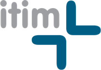

#### Copyright (c) 2022 itim Ltd

# Optimize: Interview

## Summary

The duration of the interview will be ~ 30–45 minutes.

| Time / minutes | Topic                              |
|----------------|------------------------------------|
| 5              | Discuss your background & your CV. |
| 5-10           | Recap the role & any questions.    |
| 5-10           | A programming Q&A.                 |
| 10-15          | A practical quiz.                  |
| 5              | Any final questions you may have.  |

## Your Background (~ 5 minutes)

- Can you summarize what you've done in the past 5 years?
- Why are you interested in this role?
- What are your career motivations?
- What do you enjoy doing outside of work?

## The Role Recap (~ 5 minutes)

## Programming Q&A (~ 5–10 minutes)

1. What is DRY?
    - KISS?
    - SOLID?
2. What is MVC pattern?
    - Alternatives?
3. What are objects?
    - Instance vs class variables?
    - Inheritance?
4. What is a namespace?
5. What is JSON?
6. What is the difference between .py and .pyc files?
7. What is duck typing?
    - Type hinting?
    - Difference to C, for e.g.?
8. What is a garbage collector?
9. What are linters?
    - Docstring?
    - Google style guide (see also Black)?
    - Git pre-commits?
10. What is a data type?
    - Can you name any mutable and immutable data types?
    - Pandas data types?
11. What are random numbers and how do you generate them?
    - Pseudo random numbers?
    - Seeds?
12. What is division?
    - "/" vs "//"?
    - Speed relative to multiplication?
13. What are unit tests?
    - Coverage?
14. What are lambda functions?
    - Pandas apply method?
15. What functions have you use the most in:
    - Numpy?
    - Pandas?
    - Scikit-learn?

## Practical Quiz (~ 10–15 minutes)

There will not be right/wrong answers but rather a test on your understanding and ability to solve the problems.

### Requirements

This software is written in Python v3.9:

https://www.python.org/downloads/release/python-390/

and packages will be managed using Pip:
    
https://pip.pypa.io/en/stable/installation/

### Test (with answers)

1. Clone this repo.

    > git clone https://github.com/alexjrlewis/itim_optimize_interview.git  
    > cd itim_optimize_interview/  

2. Create and checkout a "develop" branch.

    > git checkout -b develop  

3. Create virtual environment and install the requirements.

    > python3.9 -m venv venv  
    > source venv/bin/activate  
    > pip3 install --upgrade pip  
    > pip3 install -r requirements.txt  

4. Generate input (src/tasks/generate_input.py).

    ### TODO (1)
    
    > weekdays = np.resize(range(1, 8), n)  

5. Clean input (src/tasks/clean_input.py).

    ### TODO (2)
    
    > mu = df["sales_quantity"].median()  

    ### TODO (3)

    > mu, sigma = stats  
    > mu = int(mu)  

6. Generate output (src/tasks/generate_output.py).

    ### TODO (4)

    > df_process = df[["weekday", "sales_quantity"]].groupby("weekday", as_index=False).mean()  
    > df_process["sales_quantity"] = df_process["sales_quantity"].round().astype(int)  

7. Tidy/format code in src/tasks/

    > black src/tasks 

8. Run tasks

    > python3 src/task/generate_input.py  
    > python3 src/task/clean_input.py  
    > python3 src/task/generate_output.py  

## Any Questions? (~ 5 minutes)

## Finally

Thank you for your time. You will receive feedback from this interview ASAP.
